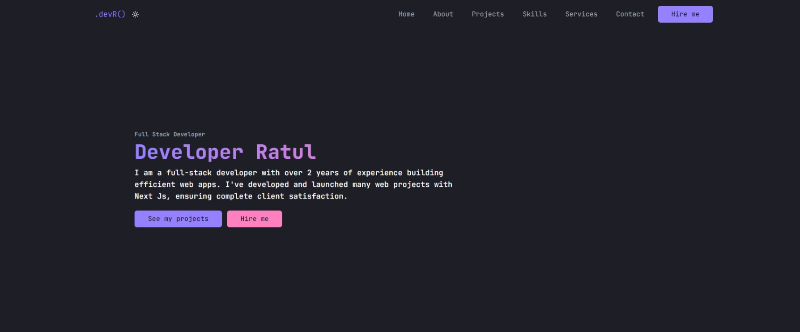

# DevR Portfolio

This is the official repository of my portfolio website.

## 🚀 Demo


Visit: [http://developeratul.vercel.app](http://developeratul.vercel.app)

## 🧐 Features

- Responsive Menu Bar 📃
- Hero section 🦸
- About section with Image
- Project Cards
- Skills section 🧑‍💻
- Service Cards
- Contact section ☎️
- Social links 🔗
- Dark 🌙 and Light Mode 🪲

## 🧑‍💻 Tech Stack

- Next Js
- React Js
- Tailwind CSS
- Hero Icons - for SVG icons
- Zod - for creating schemas
- React-Hook-Form - for doing form validation
- React Hot Toast - for showing toast messages
- Email Js - for sending emails

> This template is free to use. You can customize this template and turn it into your own portfolio. Giving attribution to the author would be highly appreciated.

## ⏩ Quick Start

Make sure you have those dependencies:

```json
{
  "node": ">=16.0.0",
  "yarn": ">=1.22.0",
  "npm": "please-use-yarn"
}
```

Then run those commands:

```bash
git clone git@github.com:developeratul/devr-commerce.git
cd devr-commerce
yarn
yarn lint
cp .env.example .env.local # please change the credentials (create an account here: http://www.emailjs.com)
yarn dev
```

## 🍰 Contributing

Pull Requests are always welcome! Send a PR if you see a way to improve or fix something (Even a Typo). Please contribute using [GitHub Flow](http://guides.github.com/introduction/flow). Create a branch, add commits, and open a pull request. After your PR has been merged, you will be added to the contributors section.

## 🛡️ License

This project is under MIT license

## 👨‍💻 Author

### 👤 Minhazur Rahman Ratul

- Twitter: [@developeratul](https://twitter.com/developeratul)
- Github: [@developeratul](https://github.com/developeratul)
